# AI-Powered Multi-Modal Attendance System

An intelligent attendance management system that lets people check in using **Face Recognition, Voice Biometrics, QR Code, or RFID** — with built-in speaker verification to prevent proxy attendance. Built with Python, Flask, and OpenCV.

---

## 📋 Table of Contents

- [Screenshots](#-screenshots)
- [Features](#features)
- [Tech Stack](#tech-stack)
- [Project Structure](#project-structure)
- [Setup Instructions](#setup-instructions)
- [Usage Guide](#usage-guide)
- [Future Scope](#future-scope--improvements)
- [Notes](#notes)

---

## 📸 Screenshots

### 🏠 Home (Dark & Light Mode)
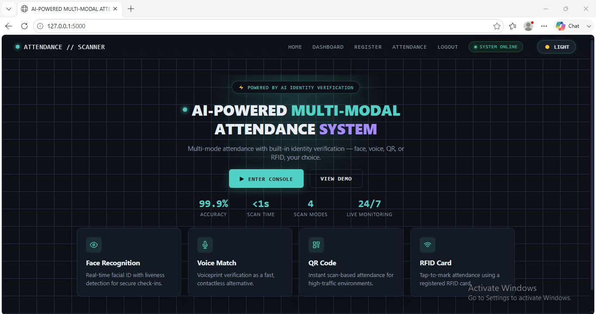 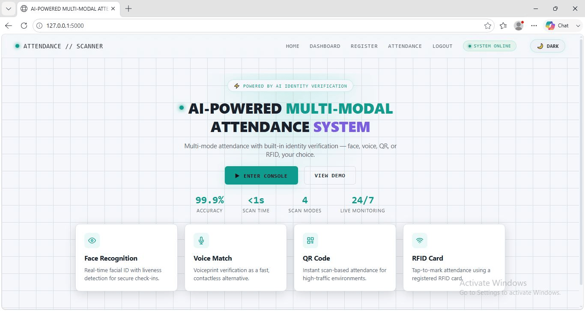

### 🔐 Admin Login
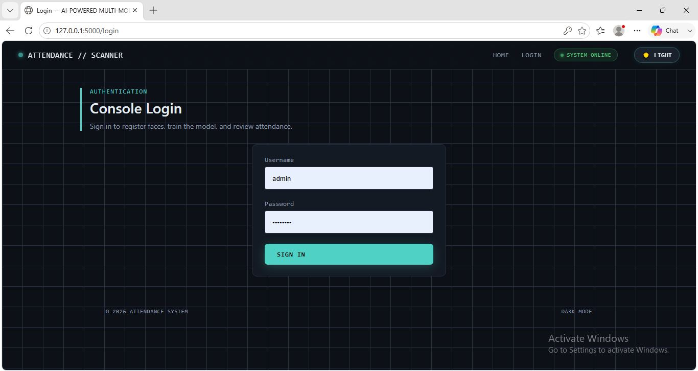

### 📊 Dashboard
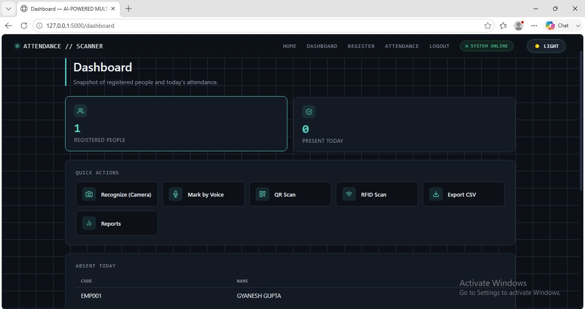

### 📝 Register a New Person
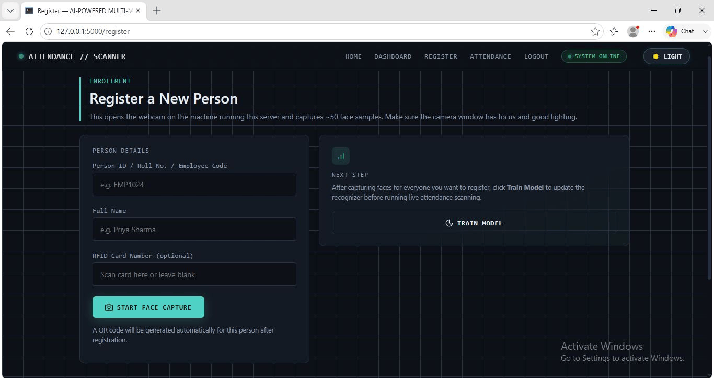

### 📷 Face Recognition Attendance
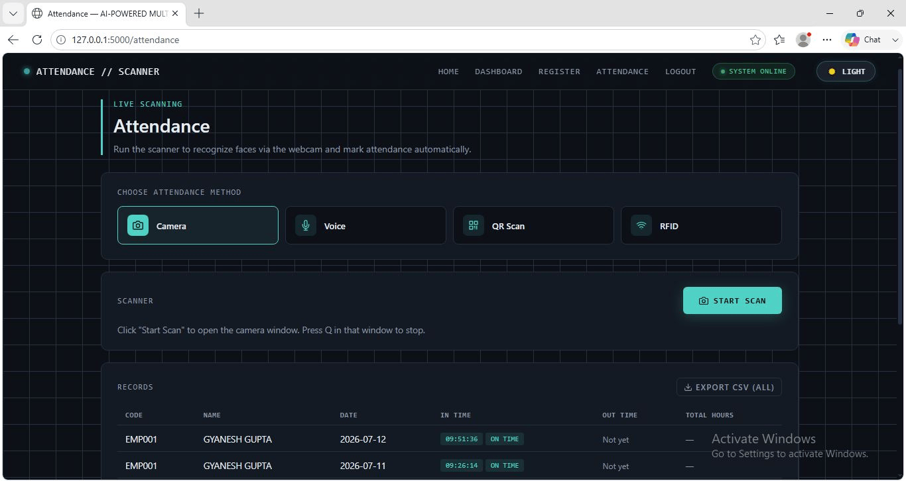
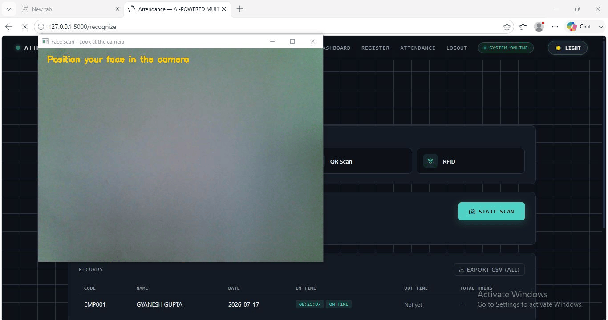

### 🎤 Voice Attendance
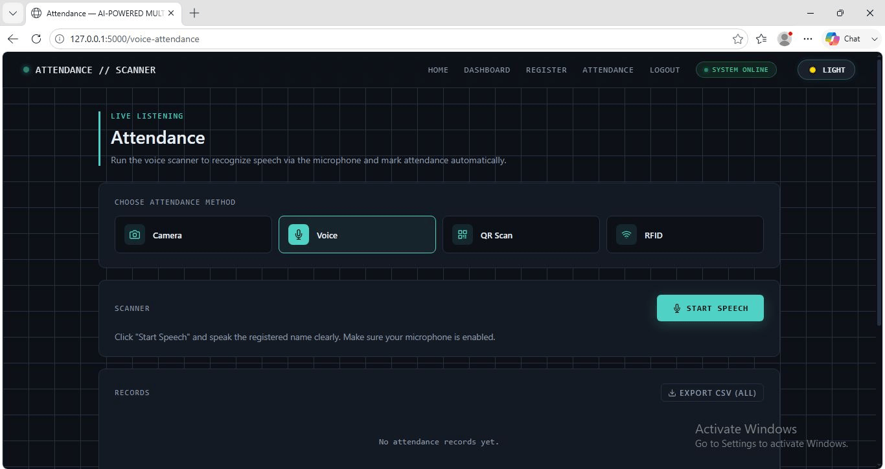

### 🔢 QR Code Attendance
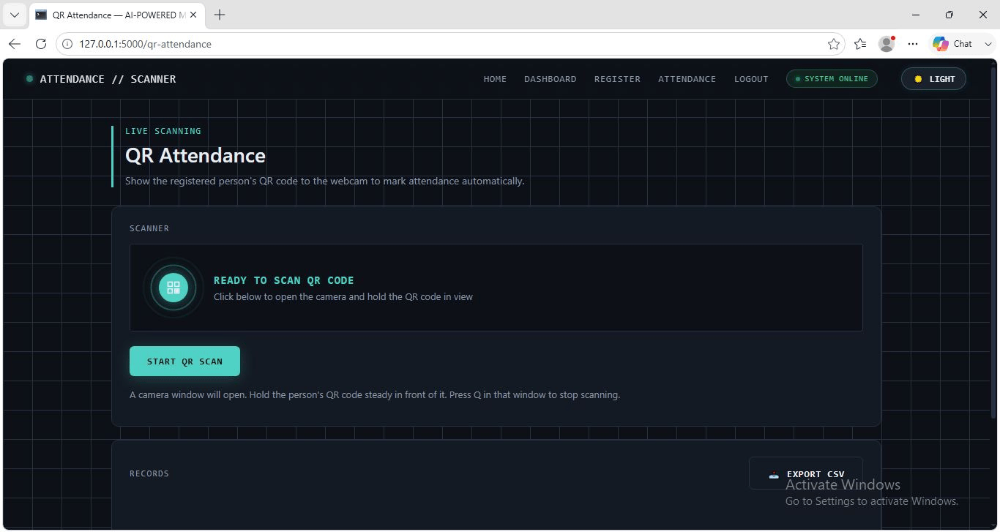
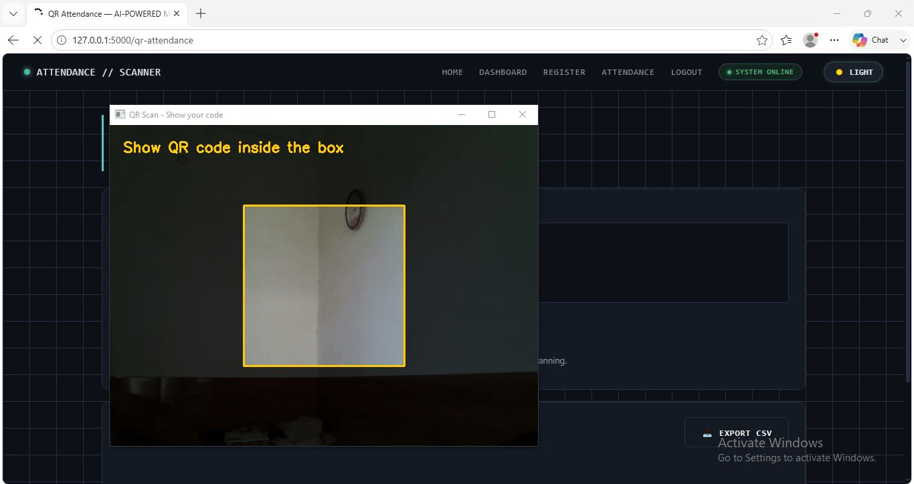

### 📶 RFID Attendance
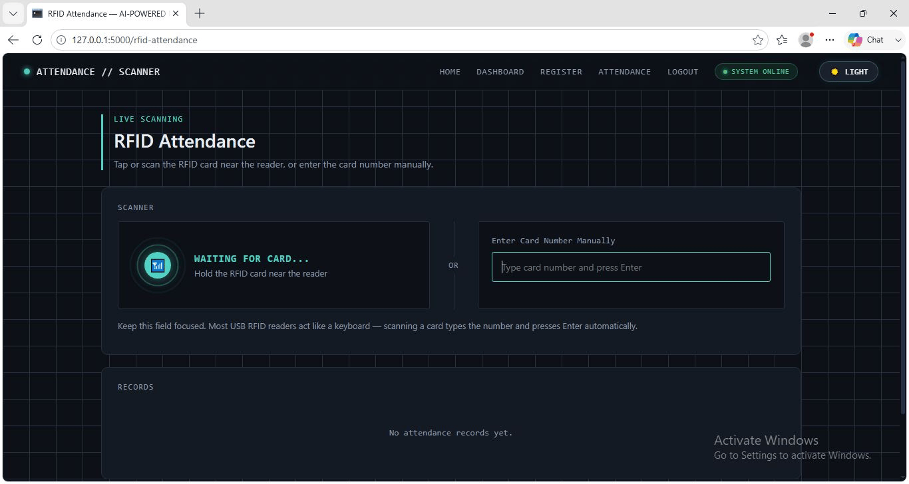
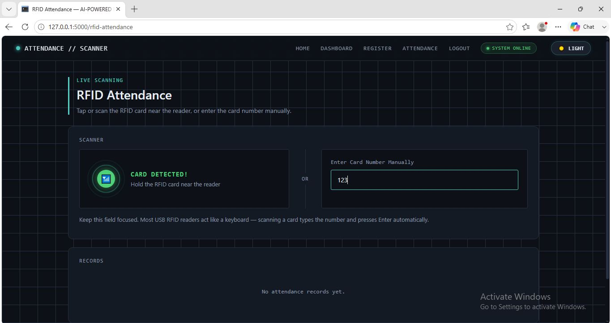

### 📈 Attendance Reports
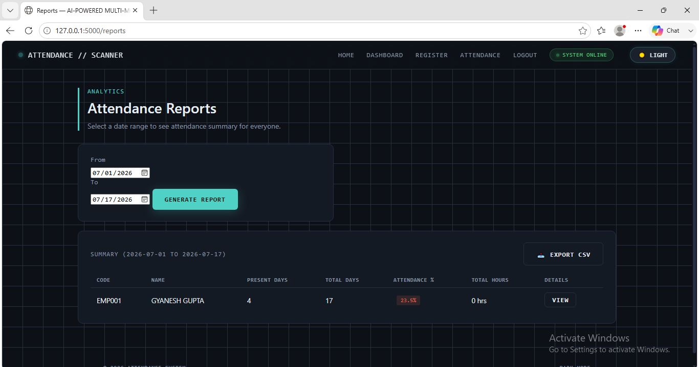

### 📤 Export Attendance
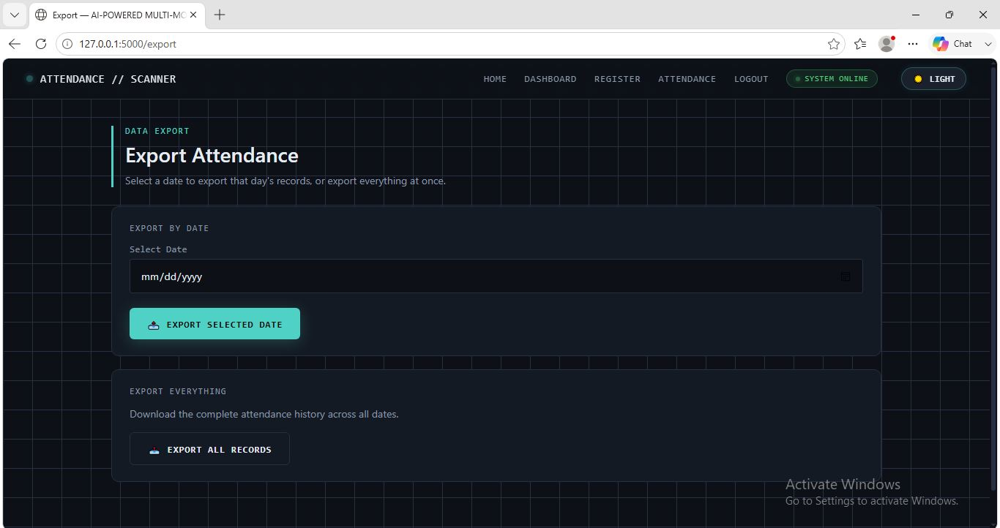

---

## ✨ Features

### 📷 Face Recognition Attendance
- Detects faces using OpenCV's Haar Cascade Classifier.
- Matches faces with an LBPH recognizer trained on ~50 samples per person.
- Marks attendance automatically on a confident match, with a spoken confirmation.

### 🎤 Voice Attendance with Speaker Verification
- Converts spoken name to text using Google Speech Recognition.
- Extracts MFCC voice features and compares them to the person's stored voiceprint.
- Marks attendance only if both the name **and** the voice match — blocking proxy attendance.

### 🔢 QR Code Attendance
- Generates a unique QR code per person using the `qrcode` library.
- Scans and decodes codes live using OpenCV's built-in `QRCodeDetector`.
- Auto-marks attendance and closes the scanner after a single successful scan.

### 📶 RFID Attendance
- Works with USB HID RFID readers that type the card number like a keyboard.
- Matches the scanned card number against each person's stored RFID value.
- Includes a manual input fallback for testing without hardware.

### ⏱️ Check-in / Check-out Tracking
- First scan of the day marks check-in; the second marks check-out.
- Automatically calculates total hours worked from in-time and out-time.
- Shared logic across all four attendance methods for consistent behavior.

### ⏰ Late Arrival Detection
- Compares check-in time against a configurable cutoff time.
- Tags each record with an "On Time" or "Late" badge.
- Cutoff is adjustable with a single variable in `app.py`.

### 🚨 Absentee Tracking
- Finds registered people with no attendance record for a given date.
- Displays a live "Absent Today" panel on the Dashboard.
- Also supports absentee lookups for any past date.

### 📊 Attendance Reports (Weekly / Monthly / Custom Range)
- Generates a summary table for all people across a selected date range.
- Shows present days, attendance percentage, and total hours, color-coded by performance.
- Lets you drill into a single person's day-by-day report.

### 📤 CSV Export
- Exports attendance records as a downloadable CSV file.
- Supports both full history and single-date exports.
- Generated in-memory with no temporary files written to disk.

### ✏️ Person Management (Edit / Delete)
- Lets admins update a person's name or RFID card after registration.
- Deleting a person removes their profile and all attendance history.
- Includes a confirmation prompt to prevent accidental deletion.

### 🌙 Dark / Light Theme
- Single toggle switches the entire UI theme instantly.
- Built with CSS custom properties swapped via a `data-theme` attribute.
- Preference is saved in `localStorage` and persists across visits.

### 🔐 Secure Admin Login
- Uses Flask-Login for session management.
- Passwords are hashed with Werkzeug — never stored in plaintext.
- All sensitive routes are protected behind `@login_required`.

---

## 🛠️ Tech Stack

| Layer | Technology |
|---|---|
| Backend | Python, Flask, Flask-Login |
| Database | SQLite |
| Face Recognition | OpenCV (LBPH Face Recognizer, Haar Cascade) |
| Voice Recognition | SpeechRecognition (Google Speech API) |
| Voice Verification | librosa (MFCC feature extraction), NumPy (cosine similarity) |
| Text-to-Speech | pyttsx3 |
| QR Code | OpenCV `QRCodeDetector`, `qrcode` (generation) |
| Frontend | HTML, CSS, JavaScript, Jinja2 templating |

---

## 📁 Project Structure

```
AI-Powered-Multi-Modal-Attendance-System/
├── app.py                     # Main Flask application & routes
├── database.py                 # SQLite database operations
├── capture_faces.py            # Face sample capture during registration
├── train_model.py              # Trains the LBPH face recognizer
├── recognize.py                # Face recognition attendance logic
├── qr_scan.py                   # QR code attendance logic
├── voice_mark.py                 # Voice attendance + speaker verification
├── voice_enroll.py               # Records voice samples for enrollment
├── voice_auth.py                  # Voiceprint creation & verification (MFCC)
├── templates/                     # HTML templates (Jinja2)
├── static/
│   ├── css/style.css               # App styling (dark/light theme)
│   ├── js/script.js                # Client-side interactivity
│   ├── qrcodes/                    # Generated QR code images
│   └── screenshots/                # README screenshots
├── trainer/                        # Trained face recognition model files
├── voiceprints/                    # Stored voiceprints (.npy files)
├── requirements.txt
└── README.md
```

---

## ⚙️ Setup Instructions

1. **Clone the repository**
   ```bash
   git clone https://github.com/Gyanesh-Gupta2002/AI_POWERED_MULTI_MODAL_ATTENDANCE_SYSTEM
   cd AI-Powered-Multi-Modal-Attendance-System
   ```

2. **Create and activate a virtual environment**
   ```bash
   python -m venv venv
   venv\Scripts\activate        # Windows
   ```

3. **Install dependencies**
   ```bash
   pip install -r requirements.txt
   ```

4. **Run the application**
   ```bash
   python app.py
   ```

5. **Open your browser** at `http://127.0.0.1:5000`

   Default admin login: `admin` / `admin123`

---

## 📖 Usage Guide

1. **Register** a new person — captures ~50 face samples, generates a unique QR code, and optionally records an RFID card number.
2. **Enroll Voice** for that person from the Register page, so voice attendance can verify their identity.
3. **Train Model** after registering people, to update the face recognizer with the latest data.
4. Mark attendance using any method — **Camera**, **Voice**, **QR Scan**, or **RFID** — accessible from the Attendance page or Dashboard quick actions.
5. View live attendance, today's absentees, and generate date-range reports from the **Dashboard** and **Reports** pages.
6. Export attendance data to CSV at any time, filtered by date or for the full history.

---

## 🚀 Future Scope / Improvements

- **Fingerprint Authentication** — add a USB fingerprint scanner as a fifth verification method.
- **Cloud Database & Multi-Device Sync** — move to PostgreSQL/MySQL for multi-kiosk deployments.
- **Mobile / Browser-Camera Support** — capture via `getUserMedia` instead of only the server's local webcam.
- **Email/SMS Notifications** — alert admins on absences or repeated lateness.
- **Role-Based Access Control** — support multiple admin roles with different permissions.
- **Liveness Detection** — add anti-spoofing checks to prevent photo-based face spoofing.
- **Shift/Schedule Management** — support multiple shifts with different cutoff times.
- **Analytics Dashboard** — add attendance and punctuality trend charts.
- **Deep Learning Face Recognition** — upgrade from LBPH to FaceNet/ArcFace embeddings.
- **Offline-First Sync** — let kiosks work offline and sync once reconnected.

---

## 📝 Notes

This application accesses the **local webcam and microphone of the machine running the Flask server** — it is designed for a single kiosk/front-desk setup, not for remote browser-based capture.

---

## 👤 Author

**Gyanesh Gupta**
MCA Student — this project was developed as part of academic coursework.

---

## 📄 License

This project is developed for educational purposes.